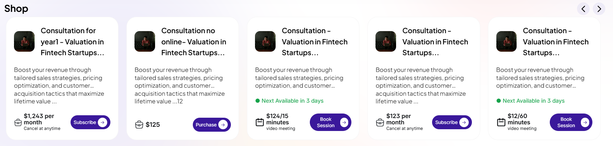

# Card Component for Consultation, Subscription, and Digital Goods

## Overview

This code defines a Vue.js component that renders a versatile card UI for displaying different types of products or services, such as consultations, subscriptions, and digital goods. The component is designed to be reusable, dynamically adapting its content and behavior based on the `cardType` and data provided. It integrates with Inertia.js for routing and includes a booking calendar modal for consultation scheduling.

## Code Explanation

### Template Section

The template is a responsive card layout built with Tailwind CSS, structured to display product or service information in a visually appealing and consistent manner. The card supports three distinct types: **consultation**, **subscription**, and **digital_good**, determined by the `cardType` computed property.

#### Structure
- **Container**: A `div` with Tailwind classes (`flex flex-col w-[296px] gap-5 p-5 rounded-[25px] border bg-white`) creates a fixed-width card with padding, rounded corners, and a subtle border.
- **Avatar and Name**:
  - Uses the `AvatarImg` component to display a thumbnail (defaulting to `/img/1.jpg` if none provided).
  - Displays the `product_name` in a truncated, ellipsis-enabled format to handle long names.
- **Description**:
  - Renders the `description` field using `v-html` for rich text support, with a `line-clamp-3` to limit it to three lines for brevity.
- **Conditional Rendering**:
  - The card content changes based on the `cardType`:
    - **Consultation**:
      - Shows availability ("Next Available in 3 days") with a green dot indicator.
      - Includes a calendar icon (SVG) and a "Book Session" button that opens a `BookingCalendar` modal.
    - **Subscription**:
      - Displays pricing with periodicity (e.g., "$100 per month" or "$100 every 2 weeks") and a "Cancel anytime" note.
      - Features a briefcase icon (`ExpertBriefcase`) and a "Subscribe" button.
    - **Digital Good**:
      - Shows a one-time price (e.g., "$50") with a briefcase icon.
      - Renders a "Purchase" button if not yet purchased, or an "Already Purchased" button if the user has bought it.
- **Buttons**:
  - All buttons use a consistent design with a purple background (`bg-[#3A189B]`), white text, and a circular arrow icon.
  - Button actions trigger `onlineMeetingBooking` (consultation) or `handleBuyNow` (subscription/digital good) functions.
- **Booking Calendar**:
  - A `BookingCalendar` component is conditionally rendered as a modal when `openCalendarModal` is `true`, allowing users to select a date and time for consultations.

#### Key Features
- **Responsive Design**: Uses Tailwind's responsive classes (e.g., `sm:text-sm`, `md:text-[15px]`) for adaptability across screen sizes.
- **Dynamic Content**: The `v-if`/`v-else-if` directives ensure the card adapts to the product type.
- **User Interaction**: Buttons trigger navigation or modal display, with login checks to redirect unauthenticated users.

### Script Section

The `<script setup>` section uses Vue 3's Composition API and integrates with Inertia.js for page management and routing.

#### Imports
- **Vue**: `ref` and `computed` for reactive state and computed properties.
- **Inertia.js**: `usePage` and `router` for accessing user authentication and navigation.
- **Components**: Custom components like `AvatarImg`, `ExpertBriefcase`, `LikeExpert`, `BookingCalendar`, and `ArrowRightCircleIcon` from Heroicons.

#### Props
- `data`: An object containing product details (e.g., `product_name`, `description`, `price`, `payment_type`, `online_meeting`, etc.).
- `expert_id`: A string identifying the expert associated with the product.

#### Computed Properties
- **cardType**:
  - Determines the card type based on `data.payment_type` and `data.online_meeting`:
    - `subscription`: When `payment_type` is "subscription".
    - `consultation`: When `payment_type` is "single_payment" and `online_meeting` is `true`.
    - `digital_good`: When `payment_type` is "single_payment" and `online_meeting` is `false`.
    - Returns `unknown` as a fallback.
- **isLoggedIn**: Checks if a user is authenticated using Inertia's `usePage().props.auth.user`.
- **formattedPrice**: Formats the price with commas (e.g., "1000" → "1,000") and removes ".00" for cleaner display.
- **selectedDateAndTime**: Combines `selectedDate` and `selectedTime` for consultation booking.
- **meetingtime**: Exposes the meeting duration from `data.meeting_duration`.
- **subscriptionPeriod**: Maps `repeat_payment_every_type` to a user-friendly string (e.g., "month" → "per month").

#### Reactive State
- `selectedDate` and `selectedTime`: Store the user-selected date and time for consultations.
- `openCalendarModal`: Controls the visibility of the `BookingCalendar` modal.

#### Functions
- **onlineMeetingBooking**: Opens the calendar modal for consultations if the user is logged in; otherwise, redirects to `/login`.
- **handleProceed**: Updates `selectedDate` and `selectedTime` from the calendar modal and triggers `handleBuyNow`.
- **handleBuyNow**: Redirects to the checkout page (`/checkout/product/:id`) with optional `event_happens_at` query parameter for consultations. Redirects to `/login` if the user is not authenticated.

### Styling
- **Tailwind CSS**: Provides a clean, utility-first approach to styling with responsive classes.
- **Custom Classes**: Uses `font-jakarta` and `font-inter` for typography consistency.
- **Hover Effects**: Buttons have a `hover:bg-[#3A189B]` for subtle interactivity.
- **Icons**: SVG icons (e.g., calendar, briefcase) enhance visual clarity.

## What I Did

As the developer, I created a reusable and dynamic Vue.js card component to display various product types (consultations, subscriptions, and digital goods) with a consistent and professional UI. Here's a breakdown of my contributions:

1. **Designed a Flexible UI**:
   - Crafted a card layout using Tailwind CSS for responsiveness and consistency.
   - Implemented conditional rendering to adapt the card's content based on the product type (`consultation`, `subscription`, `digital_good`).

2. **Integrated Dynamic Logic**:
   - Used a computed `cardType` property to determine the card type based on `payment_type` and `online_meeting` fields.
   - Added computed properties for price formatting (`formattedPrice`) and subscription period display (`subscriptionPeriod`).

3. **Handled User Interactions**:
   - Implemented button actions (`onlineMeetingBooking`, `handleBuyNow`) to manage navigation and modal display.
   - Integrated a `BookingCalendar` modal for scheduling consultations, with date and time selection.

4. **Ensured Authentication**:
   - Added checks for user authentication (`isLoggedIn`) to redirect unauthenticated users to the login page before booking or purchasing.

5. **Enhanced UX**:
   - Used ellipsis and line clamping to handle long text gracefully.
   - Incorporated icons (calendar, briefcase) and consistent button styling for a polished look.
   - Added hover effects and responsive font sizes for better usability.

6. **Integrated with Inertia.js**:
   - Leveraged Inertia.js for seamless routing to the checkout and login pages.
   - Passed query parameters for consultation scheduling (`event_happens_at`).

## Key Achievements
- **Reusability**: The component supports multiple product types with a single codebase, reducing redundancy.
- **Scalability**: Easily extensible for additional product types or features by modifying the `cardType` logic.
- **User-Friendly**: Clear visuals, responsive design, and intuitive interactions improve the user experience.
- **Robust**: Handles edge cases like unauthenticated users and missing data gracefully.

## Potential Improvements
- **Dynamic Availability**: Replace the hardcoded "Next Available in 3 days" with API-driven availability data.
- **Error Handling**: Add feedback for failed actions (e.g., checkout errors).
- **Accessibility**: Enhance ARIA attributes for better screen reader support.
- **Custom Icons**: Replace placeholder SVGs with custom-designed icons for branding consistency.

